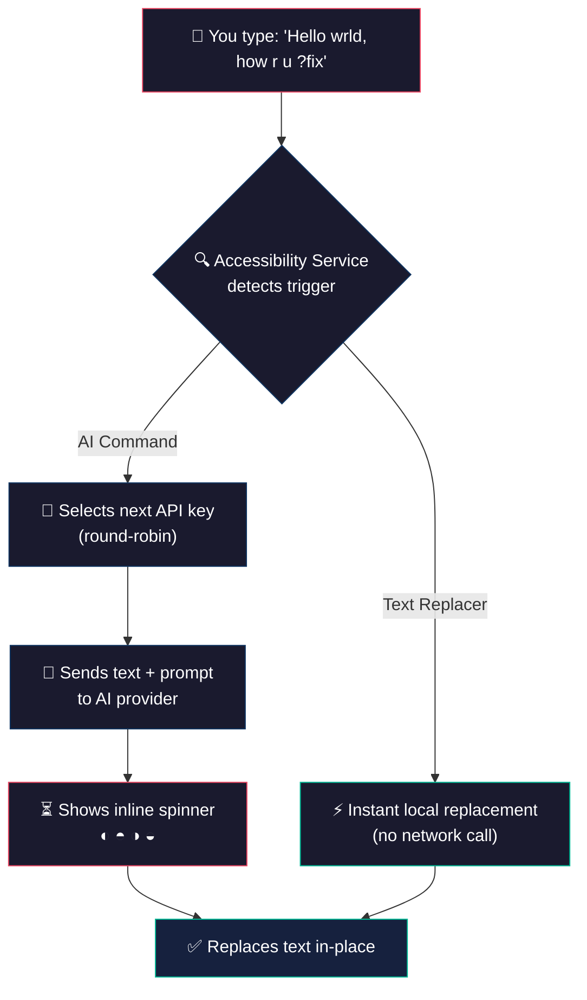
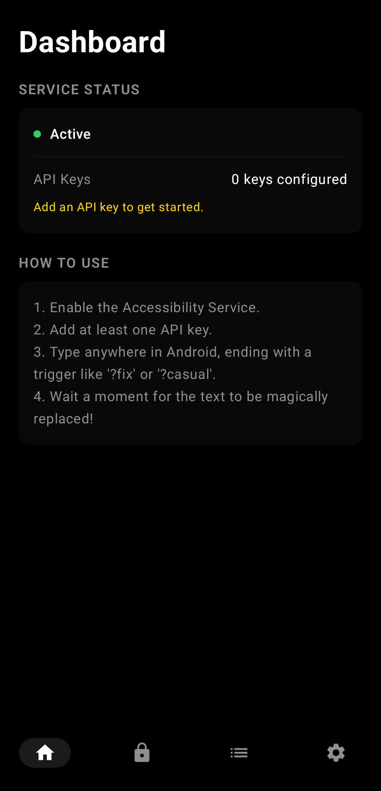
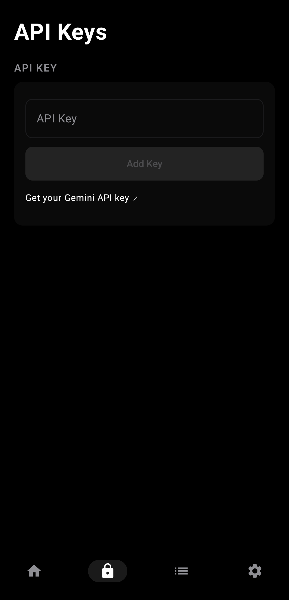
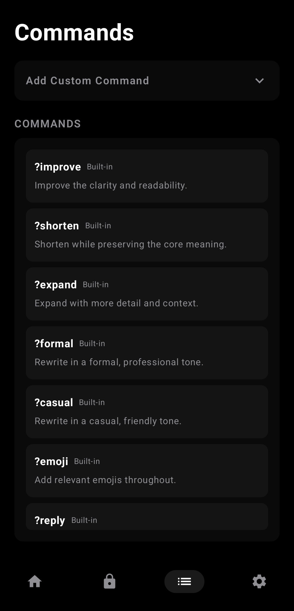
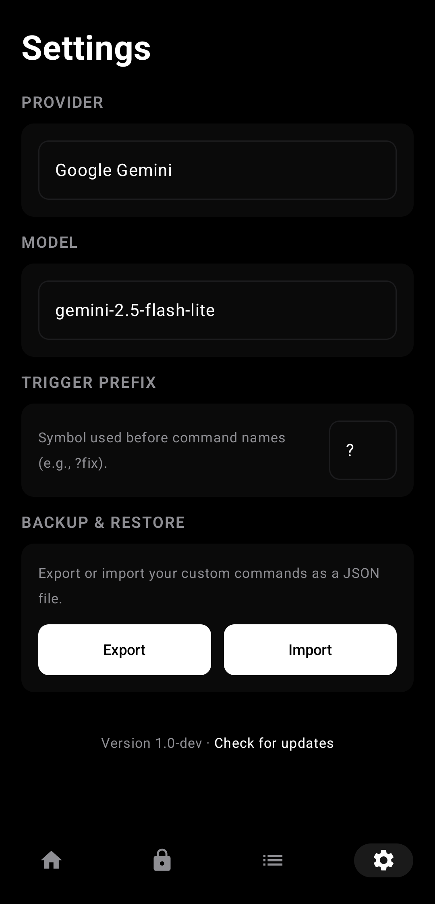
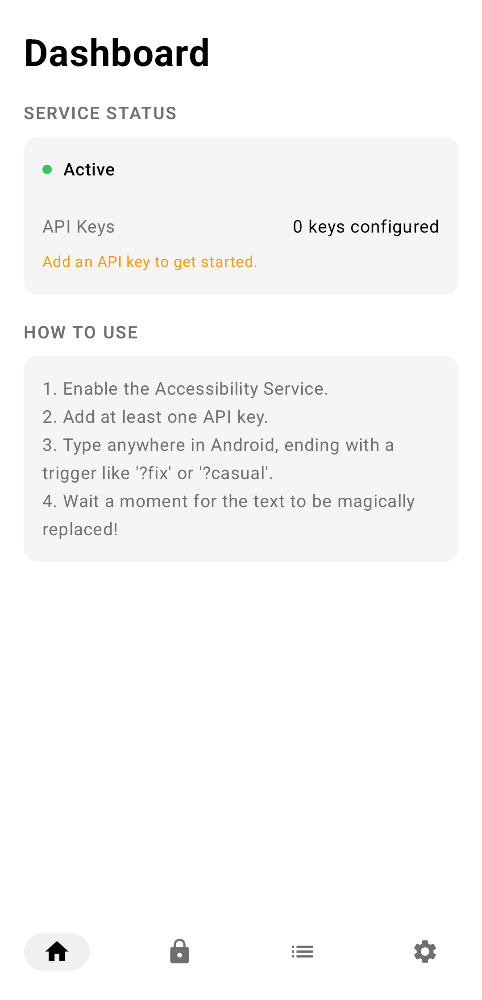
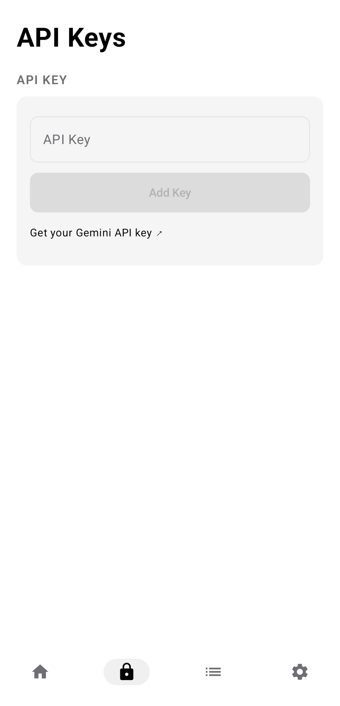
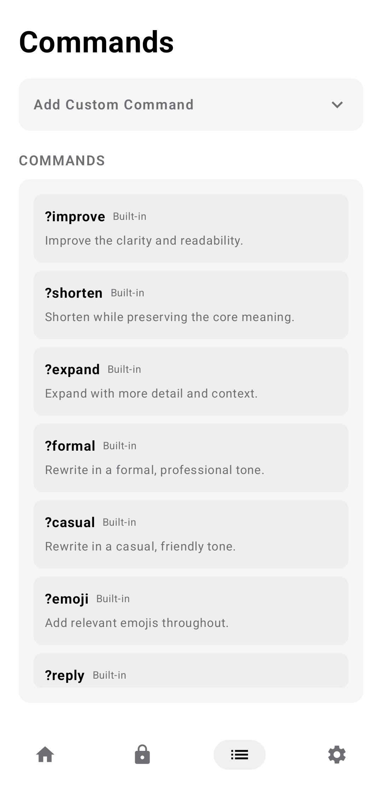
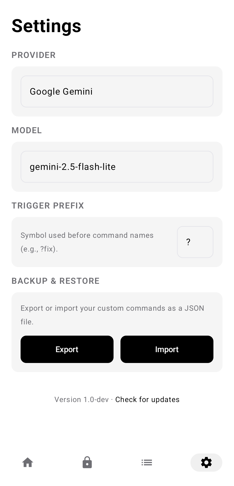

<div align="center">

<br>


<br>

# SwiftSlate

### System-wide AI text assistant for Android — powered by Gemini, Groq, and any OpenAI-compatible endpoint

Type a trigger like **`?fix`** at the end of any text, in any app, and watch it get replaced — instantly.

<br>

[](#-getting-started)
[](#%EF%B8%8F-tech-stack)
[](#-supported-ai-providers)
[](LICENSE)

[](https://github.com/Musheer360/SwiftSlate/releases/latest)
[](https://github.com/Musheer360/SwiftSlate/stargazers)
[](#)
[](#)
[](https://github.com/Musheer360/SwiftSlate/actions/workflows/build.yml)

<br>

[](https://github.com/Musheer360/SwiftSlate/releases/latest)
&nbsp;&nbsp;
[](https://github.com/Musheer360/SwiftSlate/issues)
&nbsp;&nbsp;
[](https://github.com/Musheer360/SwiftSlate/issues)

<br>

</div>

> [!NOTE]
> **SwiftSlate works in most apps** — WhatsApp, Gmail, Twitter/X, Messages, Notes, and more. No copy-pasting. No app switching. Just type and go. Some apps with custom input fields may not be supported ([see limitations](#%EF%B8%8F-known-limitations)).

<br>

## 📋 Table of Contents

- [Quick Demo](#-quick-demo)
- [Features](#-features)
- [Built-in Commands](#-built-in-commands)
- [Text Replacer Commands](#-text-replacer-commands)
- [Supported AI Providers](#-supported-ai-providers)
- [Getting Started](#-getting-started)
- [How It Works](#%EF%B8%8F-how-it-works)
- [Custom Commands](#-custom-commands)
- [API Key Management](#-api-key-management)
- [Backup & Restore](#-backup--restore)
- [App Screens](#-app-screens)
- [Screenshots](#-screenshots)
- [Localization](#-localization)
- [Privacy & Security](#-privacy--security)
- [Tech Stack](#%EF%B8%8F-tech-stack)
- [Architecture](#-architecture)
- [Building from Source](#-building-from-source)
- [Contributing](#-contributing)
- [Sponsors](#-sponsors)
- [Support the Project](#-support-the-project)
- [License](#-license)
- [Star History](#-star-history)

<br>

## ⚡ Quick Demo

```
📝  You type       →  "i dont no whats hapening ?fix"
⏳  SwiftSlate      →  ◐ ◓ ◑ ◒  (processing...)
✅  Result         →  "I don't know what's happening."
```

```
📝  You type       →  "hey can u send me that file ?formal"
⏳  SwiftSlate      →  ◐ ◓ ◑ ◒  (processing...)
✅  Result         →  "Could you please share the file at your earliest convenience?"
```

```
📝  You type       →  "Hello, how are you? ?translate:es"
⏳  SwiftSlate      →  ◐ ◓ ◑ ◒  (processing...)
✅  Result         →  "Hola, ¿cómo estás?"
```

<br>

## ✨ Features

<table>
<tr>
<td width="50%">

### 🌐 Works Almost Everywhere
Integrates at the system level via Android's Accessibility Service. Works in **most apps** — messaging, email, social media, notes, browsers, and more. Some apps with custom input fields may not be supported ([see limitations](#%EF%B8%8F-known-limitations)).

### ⚡ Instant Inline Replacement
Type, trigger, done. The AI response replaces your text directly in the same field — no copy-pasting, no app switching. A spinner (`◐ ◓ ◑ ◒`) shows progress for AI commands; text replacer commands execute instantly.

### 🔑 Multi-Key Rotation
Add multiple API keys for automatic round-robin rotation. If one key hits a rate limit, SwiftSlate seamlessly switches to the next.

### 🌙 AMOLED Dark Theme
Pure black (`#000000`) Material 3 interface designed for OLED screens — saves battery and looks stunning. Light theme also included.

</td>
<td width="50%">

### 🤖 Multi-Provider AI
Ships with Google Gemini, Groq, or connect **any OpenAI-compatible endpoint** — cloud providers, or **local LLMs** like [Ollama](https://ollama.com), [LM Studio](https://lmstudio.ai), and others running on your network.

### 🛠️ Two Command Types
**AI commands** send text to your provider for intelligent transformation. **Text replacer commands** run entirely offline for instant local text manipulation — no API key needed.

### 🔒 Encrypted Key Storage
API keys are encrypted with **AES-256-GCM** using the Android Keystore. Your keys never leave your device unencrypted.

### 🌍 Localized in 7 Languages
App UI available in English, French, German, Spanish, Portuguese (BR), Hindi, and Simplified Chinese.

</td>
</tr>
</table>

<br>

## 🧩 Built-in Commands

SwiftSlate ships with **9 AI-powered commands** plus dynamic translation — ready to use out of the box:

| Trigger | Action | Example |
|:--------|:-------|:--------|
| **`?fix`** | Fix grammar, spelling & punctuation | `i dont no whats hapening` → `I don't know what's happening.` |
| **`?improve`** | Improve clarity and readability | `The thing is not working good` → `The feature isn't functioning properly.` |
| **`?shorten`** | Shorten while keeping meaning | `I wanted to let you know that I will not be able to attend the meeting tomorrow` → `I can't attend tomorrow's meeting.` |
| **`?expand`** | Expand with more detail | `Meeting postponed` → `The meeting has been postponed to a later date. We will share the updated schedule soon.` |
| **`?formal`** | Rewrite in professional tone | `hey can u send me that file` → `Could you please share the file at your earliest convenience?` |
| **`?casual`** | Rewrite in friendly tone | `Please confirm your attendance at the event` → `Hey, you coming to the event? Let me know!` |
| **`?emoji`** | Add relevant emojis | `I love this new feature` → `I love this new feature! 🎉❤️✨` |
| **`?reply`** | Generate a contextual reply | `Do you want to grab lunch tomorrow?` → `Sure, I'd love to! What time works for you?` |
| **`?undo`** | Restore text from before the last replacement | Reverts to your original text before AI modified it |
| **`?translate:XX`** | Translate to any language | `Hello, how are you?` **`?translate:es`** → `Hola, ¿cómo estás?` |

<details>
<summary>🌍 <strong>Supported language codes for translation</strong></summary>

<br>

Use any standard language code with `?translate:XX`:

| Code | Language | Code | Language | Code | Language |
|:-----|:---------|:-----|:---------|:-----|:---------|
| `es` | Spanish | `fr` | French | `de` | German |
| `ja` | Japanese | `ko` | Korean | `zh` | Chinese |
| `hi` | Hindi | `ar` | Arabic | `pt` | Portuguese |
| `it` | Italian | `ru` | Russian | `nl` | Dutch |
| `tr` | Turkish | `pl` | Polish | `sv` | Swedish |

…and many more. Any ISO 639 language code works — the AI model handles it.

</details>

<br>

## 🛠️ Text Replacer Commands

Beyond AI, you can create **text replacer commands** that run **entirely offline** — no API key, no network, instant execution:

| Use Case | Trigger | Replacement | Result |
|:---------|:--------|:------------|:-------|
| **Signatures** | `?sig` | `— John Doe, CEO` | Appends your signature |
| **Canned responses** | `?ty` | `Thank you for reaching out! I'll get back to you shortly.` | Instant reply template |
| **Snippets** | `?addr` | `123 Main St, Springfield, IL 62701` | Quick address insertion |
| **Shortcuts** | `?email` | `contact@example.com` | Fast email insertion |

> [!TIP]
> Text replacer commands execute instantly with zero latency — no spinner, no network call. Create them in the **Commands** tab by selecting the **"Text Replacer"** type.

<br>

## 🤖 Supported AI Providers

| Provider | Models | Notes |
|:---------|:-------|:------|
| **Google Gemini** (default) | `gemini-2.5-flash-lite`, `gemini-3-flash-preview`, `gemini-3.1-flash-lite-preview` | Free tier available at [aistudio.google.com](https://aistudio.google.com) |
| **Groq** | `llama-3.3-70b-versatile`, `llama-3.1-8b-instant`, `openai/gpt-oss-120b`, `openai/gpt-oss-20b`, `meta-llama/llama-4-scout-17b-16e-instruct` | Free tier at [console.groq.com](https://console.groq.com/keys) |
| **Custom (OpenAI-compatible)** | Any model your endpoint supports | Works with Ollama, LM Studio, vLLM, any `/v1/chat/completions` endpoint |

> [!TIP]
> For local LLMs, set the endpoint to your machine's local address (e.g., `http://localhost:11434/v1` for Ollama). HTTP is allowed for `localhost`, `127.0.0.1`, and `10.0.2.2`.

<br>

## 🚀 Getting Started

### Prerequisites

| Requirement | Details |
|:------------|:--------|
| **Android Device** | Android 6.0+ (API 23 or higher) |
| **API Key** | Free Gemini key at [aistudio.google.com](https://aistudio.google.com), or a key from Groq / any OpenAI-compatible provider. *Not required for text replacer commands.* |

### Installation

> [!TIP]
> The APK is only ~1.2 MB — lightweight with zero external dependencies for networking or JSON.

**1.** Download the latest APK from the [**Releases**](https://github.com/Musheer360/SwiftSlate/releases/latest) page

**2.** Install the APK on your device (allow installation from unknown sources if prompted)

**3.** Open SwiftSlate and follow the setup below

### Setup in 3 Steps

<table>
<tr>
<td width="33%" align="center">

**Step 1**

🔑 **Add API Key**

Open the **Keys** tab, enter your API key. It's validated before saving. Add multiple keys for rotation.

</td>
<td width="33%" align="center">

**Step 2**

♿ **Enable Service**

On the **Dashboard**, tap **"Enable"** → find **"SwiftSlate Assistant"** in Accessibility Settings → toggle it on.

</td>
<td width="33%" align="center">

**Step 3**

✍️ **Start Typing!**

Open any app, type your text, add a trigger like `?fix` at the end, and watch the magic happen.

</td>
</tr>
</table>

<br>

## ⚙️ How It Works



<details>
<summary>🔧 <strong>Technical deep-dive</strong></summary>

<br>

1. **Event Listening** — SwiftSlate registers an Accessibility Service that listens for `TYPE_VIEW_TEXT_CHANGED` events across all apps (ignoring its own UI and password fields)
2. **Fast Exit Optimization** — For performance, it first checks if the last character of typed text matches any known trigger's last character before doing a full scan
3. **Longest Match** — When a potential match is found, it searches for the longest matching trigger at the end of the text
4. **Command Routing** — Text replacer commands execute immediately on-device. AI commands proceed to the API call path
5. **API Call** — The text + prompt is sent to the configured AI provider using the next available key in the round-robin rotation
6. **Inline Spinner** — While waiting for the AI response, a spinner animation (`◐ ◓ ◑ ◒`) replaces the text to provide visual feedback
7. **Watchdog Timer** — A 120-second safety timer auto-cancels stuck processing jobs to prevent the service from becoming unresponsive
8. **Text Replacement** — The response replaces the original text using `ACTION_SET_TEXT`
9. **Fallback Strategy** — If `ACTION_SET_TEXT` fails (some apps don't support it), SwiftSlate falls back to a clipboard-based select-all + paste approach
10. **Post-Replace Verification** — A delayed check ensures the IME didn't clobber the replacement, re-applying if needed
11. **Bounded Responses** — API responses are capped at 1 MB to prevent memory issues from malformed responses

</details>

<br>

## 🎨 Custom Commands

Create, edit, and manage your own commands in the **Commands** tab.

### Two Types of Custom Commands

| Type | How It Works | Needs API Key? | Latency |
|:-----|:-------------|:---------------|:--------|
| **AI** | Sends text to your AI provider with your custom prompt | Yes | ~1–3 seconds |
| **Text Replacer** | Replaces the trigger with a fixed string, entirely offline | No | Instant |

### Example AI Command Ideas

| Trigger | Prompt | Use Case |
|:--------|:-------|:---------|
| `?eli5` | `Explain this like I'm five years old.` | Simplify complex topics |
| `?bullet` | `Convert this text into bullet points.` | Quick formatting |
| `?headline` | `Rewrite this as a catchy headline.` | Social media posts |
| `?code` | `Convert this description into pseudocode.` | Developer shorthand |
| `?tldr` | `Summarize this text in one sentence.` | Quick summaries |

> [!TIP]
> Just describe the transformation you want — SwiftSlate's system instruction automatically ensures the AI returns only the transformed text without extra commentary.

<br>

## 🔑 API Key Management

SwiftSlate supports multiple API keys with intelligent rotation:

| Feature | Details |
|:--------|:--------|
| **Round-Robin Rotation** | Keys are used in turn to spread usage evenly across all configured keys |
| **Rate-Limit Handling** | If a key gets rate-limited (HTTP 429), SwiftSlate tracks the cooldown and skips it automatically |
| **Invalid Key Detection** | Keys returning 401/403 errors are marked invalid and excluded from rotation |
| **Encrypted Storage** | All keys encrypted with AES-256-GCM via Android Keystore before being saved locally |
| **Live Validation** | Keys are validated against the provider's API before being saved |

> [!TIP]
> Adding **2–3 API keys from different accounts** helps avoid rate limits during heavy use. On the free tier, all keys under the same account share a single quota — so rotation only helps with keys from separate accounts.

<br>

## 💾 Backup & Restore

Export and import your custom commands as JSON files — useful for migrating to a new device or sharing command sets.

- **Export** — Saves all custom commands to a `.json` file via Android's file picker
- **Import** — Loads commands from a `.json` file (validates format, trigger prefix, and size limits before importing)

Find both options in the **Settings** tab under **Backup & Restore**.

> [!NOTE]
> Imported commands must use the same trigger prefix currently configured in the app. API keys are **not** included in backups for security.

<br>

## 🖥️ App Screens

SwiftSlate has **four screens** accessible via the bottom navigation bar:

<table>
<tr>
<td width="25%" valign="top">

#### 📊 Dashboard
- Service status indicator (green/red)
- Enable/disable toggle
- API key count
- Quick-start guide
- Version info & update check

</td>
<td width="25%" valign="top">

#### 🔑 Keys
- Add new keys (validated live)
- Delete existing keys
- AES-256-GCM encryption
- Multi-key management
- Direct link to get API keys

</td>
<td width="25%" valign="top">

#### 📝 Commands
- 9 built-in commands (read-only)
- Add custom commands (AI or Text Replacer)
- Edit existing custom commands
- Delete custom commands

</td>
<td width="25%" valign="top">

#### ⚙️ Settings
- **Provider selection** (Gemini, Groq, Custom)
- **Model picker** per provider
- Custom endpoint URL & model
- Trigger prefix customization
- Backup & restore commands

</td>
</tr>
</table>

<br>

## 📸 Screenshots

<div align="center">

**Dark Mode**

<table>
<tr>
<td></td>
<td></td>
</tr>
<tr>
<td></td>
<td></td>
</tr>
</table>

**Light Mode**

<table>
<tr>
<td></td>
<td></td>
</tr>
<tr>
<td></td>
<td></td>
</tr>
</table>

</div>

<br>

## 🌍 Localization

SwiftSlate's UI is available in **7 languages**:

| Language | Code |
|:---------|:-----|
| 🇺🇸 English | `en` |
| 🇫🇷 French | `fr` |
| 🇩🇪 German | `de` |
| 🇪🇸 Spanish | `es` |
| 🇧🇷 Portuguese (Brazil) | `pt-rBR` |
| 🇮🇳 Hindi | `hi` |
| 🇨🇳 Simplified Chinese | `zh-rCN` |

The app automatically uses your device's language. Contributions for additional translations are welcome!

<br>

## 🔒 Privacy & Security

> [!NOTE]
> SwiftSlate is built with privacy as a **core architectural principle**, not an afterthought.

| | Concern | How SwiftSlate Handles It |
|:--|:--------|:------------------------|
| 👁️ | **Text Monitoring** | Only processes text when a trigger command is detected at the end. All other typing is completely ignored. Password fields are always skipped. |
| 📡 | **Data Transmission** | Text is sent **only** to the configured AI provider (Google Gemini, Groq, or your custom endpoint). No other servers are ever contacted. Text replacer commands never leave your device. |
| 🔐 | **Key Storage** | API keys are encrypted with AES-256-GCM using the Android Keystore system. Encryption failures throw rather than falling back to plaintext. |
| 📊 | **Analytics** | **None.** Zero telemetry, zero tracking, zero crash reporting. |
| 📖 | **Open Source** | The entire codebase is open for inspection under the MIT License. |
| 🔑 | **Permissions** | Only requires the Accessibility Service permission — nothing else. |
| 💾 | **Backups** | API keys and settings are excluded from Android cloud backups and device transfers. |

<br>

## 🏗️ Tech Stack

<table>
<tr><td><strong>Language</strong></td><td>Kotlin 2.1</td></tr>
<tr><td><strong>UI</strong></td><td>Jetpack Compose · Material 3</td></tr>
<tr><td><strong>Async</strong></td><td>Kotlin Coroutines</td></tr>
<tr><td><strong>HTTP</strong></td><td><code>HttpURLConnection</code> (zero external dependencies)</td></tr>
<tr><td><strong>JSON</strong></td><td><code>org.json</code> (Android built-in)</td></tr>
<tr><td><strong>Storage</strong></td><td>SharedPreferences (encrypted via Android Keystore)</td></tr>
<tr><td><strong>Core Service</strong></td><td>Android Accessibility Service</td></tr>
<tr><td><strong>Build System</strong></td><td>Gradle with Kotlin DSL</td></tr>
<tr><td><strong>Java Target</strong></td><td>JDK 17</td></tr>
<tr><td><strong>Min SDK</strong></td><td>API 23 (Android 6.0)</td></tr>
<tr><td><strong>Target SDK</strong></td><td>API 36</td></tr>
</table>

> **Zero third-party dependencies** for networking or JSON parsing — SwiftSlate uses only Android's built-in APIs.

<br>

## 🏛️ Architecture

```
com.musheer360.swiftslate/
├── service/
│   └── AssistantService.kt      # Core accessibility service — event listening,
│                                 # trigger detection, text replacement, inline spinner
├── api/
│   ├── GeminiClient.kt          # Google Gemini API client
│   ├── OpenAICompatibleClient.kt # Unified client for Groq + any OpenAI-compatible endpoint
│   └── ApiClientUtils.kt        # Shared utilities — response parsing, error handling,
│                                 # structured output extraction, system prompt
├── manager/
│   ├── KeyManager.kt            # AES-256-GCM encrypted key storage, round-robin rotation,
│   │                            # rate-limit tracking, invalid key detection
│   └── CommandManager.kt        # Command CRUD, trigger matching (longest-match),
│                                # prefix migration, import/export
├── model/
│   ├── Command.kt               # Command data class (AI or Text Replacer)
│   └── ProviderType.kt          # Provider constants (gemini, groq, custom)
├── ui/
│   ├── DashboardScreen.kt       # Service status, key count, quick-start guide
│   ├── KeysScreen.kt            # API key management with live validation
│   ├── CommandsScreen.kt        # Command list, add/edit/delete with collapsible form
│   ├── SettingsScreen.kt        # Provider, model, prefix, backup/restore
│   ├── components/              # Reusable UI components (cards, text fields, dividers)
│   └── theme/Theme.kt           # AMOLED dark + light Material 3 color schemes
├── MainActivity.kt              # AnimatedContent tab navigation (4 tabs)
├── SwiftSlateViewModel.kt       # Shared ViewModel exposing managers + prefs
└── SwiftSlateApp.kt             # Application class — SharedPreferences pre-warming
```

<br>

## 🔨 Building from Source

### Prerequisites

- [**Android Studio**](https://developer.android.com/studio) (latest stable)
- **JDK 17+**
- **Android SDK** with API level 36

### Build

```bash
# Clone the repository
git clone https://github.com/Musheer360/SwiftSlate.git
cd SwiftSlate

# Build debug APK
./gradlew assembleDebug

# Output: app/build/outputs/apk/debug/app-debug.apk
```

### Install on device

```bash
adb install app/build/outputs/apk/debug/app-debug.apk
```

<details>
<summary>📦 <strong>Signed release build</strong></summary>

<br>

```bash
export KEYSTORE_FILE=/path/to/your/keystore.jks
export KEYSTORE_PASSWORD=your_keystore_password
export KEY_ALIAS=your_key_alias
export KEY_PASSWORD=your_key_password

./gradlew assembleRelease
```

</details>

<br>

## ⚠️ Known Limitations

- **Some apps use custom input fields** that don't support Android's standard text replacement APIs. SwiftSlate includes a clipboard-based fallback, but apps like **WeChat** and **Chrome's address bar** may still not work. Most standard text fields (messaging apps, email composers, notes, etc.) work fine.
- **Some OEMs restrict accessibility services.** Certain manufacturers (e.g., OnePlus, Xiaomi) may hide or block third-party accessibility services in their settings UI. If SwiftSlate doesn't appear in your accessibility settings, check for a "Downloaded apps" or "Installed services" section, or try searching for it.

<br>

## 🤝 Contributing

Contributions are welcome! Here's how to get involved:

```bash
# 1. Fork the repository, then:
git clone https://github.com/YOUR_USERNAME/SwiftSlate.git
cd SwiftSlate

# 2. Create a feature branch
git checkout -b feature/amazing-feature

# 3. Make your changes and commit
git commit -m "Add amazing feature"

# 4. Push and open a Pull Request
git push origin feature/amazing-feature
```

### Ideas for Contributions

- 🧩 New built-in commands
- 🤖 Additional AI provider integrations
- 🎨 UI improvements and new themes
- 🌍 Translations for more languages
- 📖 Documentation improvements

<br>

## 💜 Sponsors

SwiftSlate is made possible by the generous support of its sponsors. Thank you!

<table>
<tr>
<td align="center">
<a href="https://github.com/lifearien">
<br>
<strong>@lifearien</strong>
</a>
</td>
</tr>
</table>

Want to see your name here? [**Become a sponsor →**](https://github.com/sponsors/Musheer360)

<br>

## ❤️ Support the Project

SwiftSlate is free, open source, and built in my spare time. If it's useful to you, consider supporting its development:

- ⭐ **Star this repo** — it helps others discover SwiftSlate
- 💖 [**Sponsor on GitHub**](https://github.com/sponsors/Musheer360) — even a small contribution keeps the project going

<br>

## 📄 License

This project is licensed under the **MIT License** — see the [LICENSE](LICENSE) file for details.

<br>

## 📈 Star History

<div align="center">

<a href="https://star-history.com/#Musheer360/SwiftSlate&Date">
  <picture>
    <source media="(prefers-color-scheme: dark)" srcset="https://api.star-history.com/svg?repos=Musheer360/SwiftSlate&type=Date&theme=dark" />
    <source media="(prefers-color-scheme: light)" srcset="https://api.star-history.com/svg?repos=Musheer360/SwiftSlate&type=Date" />
    
  </picture>
</a>

</div>

<br>

---

<div align="center">

<br>

Made with ❤️ by [**Musheer Alam**](https://github.com/Musheer360)

If SwiftSlate makes your typing life easier, consider giving it a ⭐

<br>

</div>
